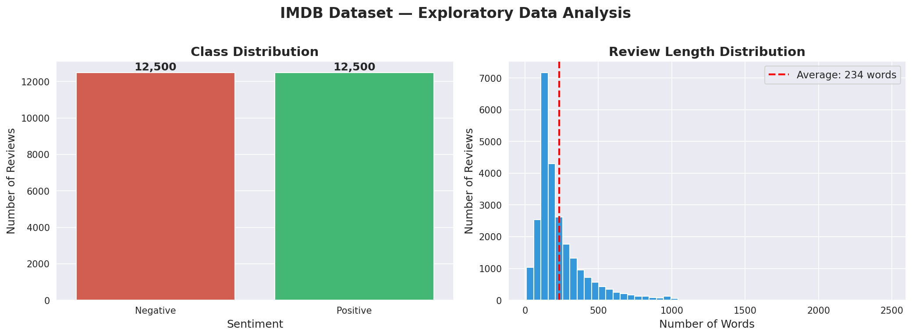
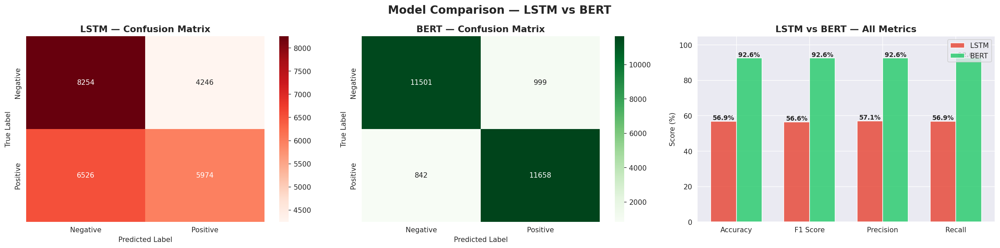
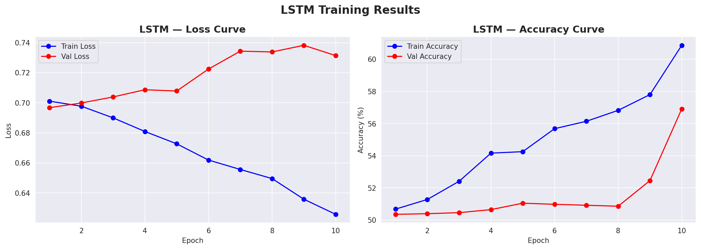
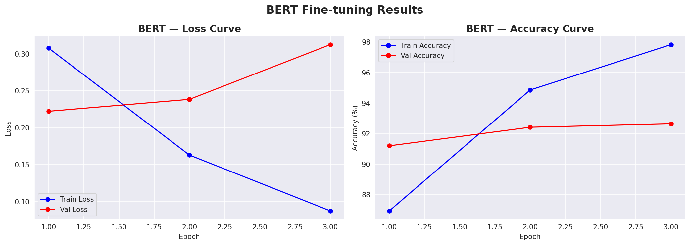

# Sentiment Analysis: LSTM vs BERT

A head-to-head comparison of two deep learning architectures — a classical LSTM and a fine-tuned BERT transformer — on binary sentiment classification of movie reviews.

## Overview

| | |
|---|---|
| **Task** | Binary sentiment classification (positive / negative) |
| **Dataset** | IMDB Movie Reviews (HuggingFace `stanfordnlp/imdb`) — 50,000 reviews, 25k train / 25k test, perfectly balanced |
| **Models** | LSTM (trained from scratch) vs `bert-base-uncased` (fine-tuned) |
| **Frameworks** | PyTorch, HuggingFace Transformers, scikit-learn |

## Dataset



The dataset is perfectly balanced (12,500 positive / 12,500 negative), with an average review length of 234 words.

## Results

| Metric | LSTM | BERT |
|---|---|---|
| Accuracy | 56.91% | **92.64%** |
| F1 Score | 56.55% | **92.64%** |
| Precision | 57.15% | **92.64%** |
| Recall | 56.91% | **92.64%** |
| Parameters | 3,482,114 | 109,483,778 |
| Epochs trained | 10 | 3 |



BERT outperformed the LSTM by **+35.7 percentage points** in accuracy, despite training for fewer epochs — its pretraining on a large text corpus gave it a strong head start on understanding English before ever seeing an IMDB review.

### Training Curves

<table>
<tr>
<td width="50%">

**LSTM** — overfits after ~epoch 6: training accuracy keeps climbing while validation accuracy plateaus around 51–57%.



</td>
<td width="50%">

**BERT** — generalizes well: validation accuracy tracks training accuracy closely across all 3 epochs.



</td>
</tr>
</table>

## Key Findings

- **LSTM struggled with vanishing gradients.** An early version of the model got stuck at ~50% accuracy (equivalent to random guessing) for several epochs. This was diagnosed and addressed by adjusting embedding dimensions, the number of stacked LSTM layers, and the learning rate.
- **LSTM overfit even after the fix** — training accuracy kept climbing while validation accuracy plateaued, showing the model was memorizing rather than generalizing.
- **BERT generalized well** — training and validation accuracy stayed close across all 3 epochs (97.83% train vs 92.64% val by the final epoch), with no major overfitting.
- **Trade-off**: BERT needs ~30x more parameters and a GPU to fine-tune in reasonable time, while the LSTM is far lighter and trains on CPU — a real consideration for deployment-constrained environments.

## Pipeline

1. **EDA** — class balance check, review length distribution, example reviews per class
2. **Preprocessing** — HTML tag removal, lowercasing; separate pipelines per model:
   - LSTM: word-level vocabulary (20k most frequent words) + padding to 256 tokens
   - BERT: subword tokenization via `BertTokenizer`
3. **Model training**
   - LSTM: Embedding → LSTM → Dropout → Linear classifier head
   - BERT: `bert-base-uncased` + classification head, fine-tuned end-to-end
4. **Evaluation** — accuracy, F1, precision, recall, confusion matrices on the full 25k test set

## Repo Structure

```
├── NLP_Sentiment_LSTM_vs_BERT.ipynb   # Full notebook: EDA → preprocessing → training → evaluation
├── app.py                             # App for running inference
├── lstm_model.pth                     # Trained LSTM weights
├── eda_visualization.png              # Class balance & review length plots
├── lstm_training_curves.png           # LSTM loss/accuracy over epochs
├── bert_training_curves.png           # BERT loss/accuracy over epochs
├── model_comparison.png               # Side-by-side metric comparison + confusion matrices
└── final-NLP_Report_Sentiment_LSTM_vs_BERT.docx  # Full written report
```

## Tech Stack

`Python` `PyTorch` `HuggingFace Transformers` `scikit-learn` `pandas` `matplotlib` `seaborn`

## Author

**Imene Chehata** — [LinkedIn](https://www.linkedin.com/in/chehata-imene-59b347311)
